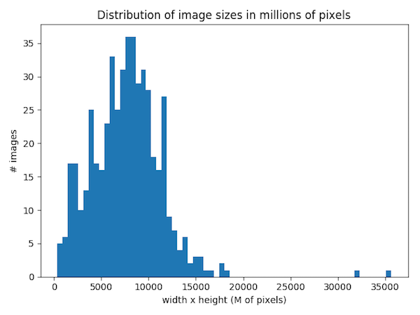
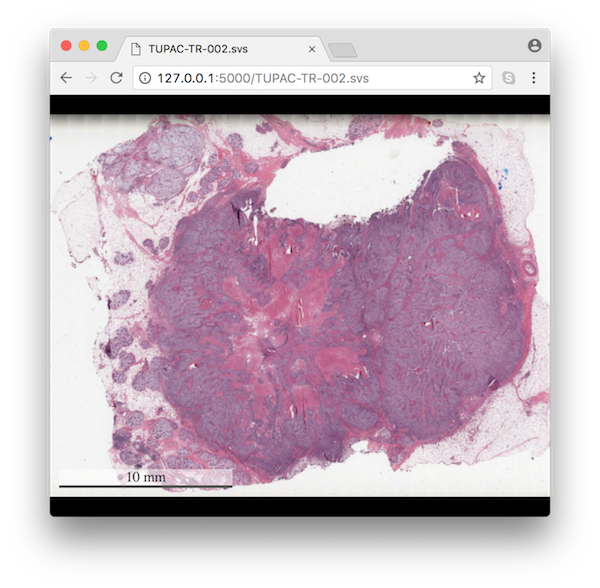
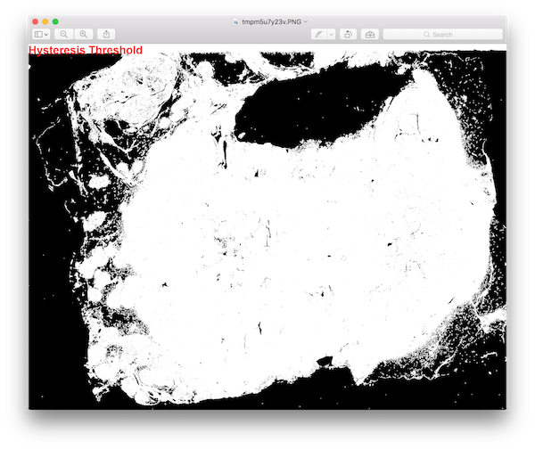
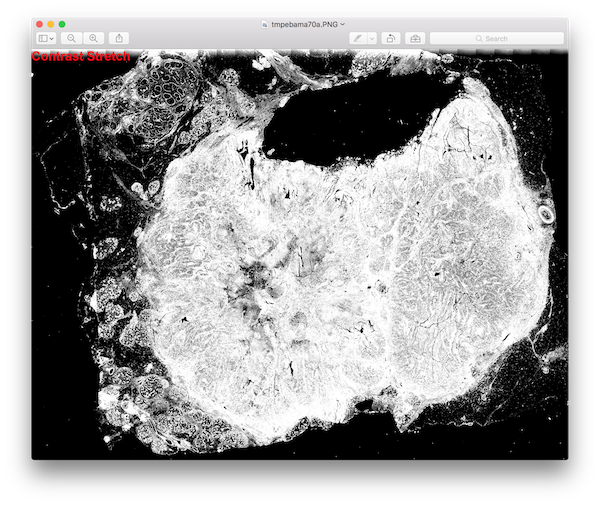
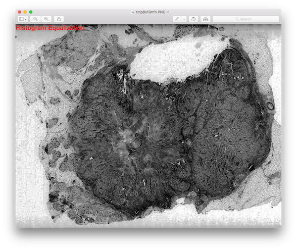

<!--

Licensed to the Apache Software Foundation (ASF) under one or more
contributor license agreements.  See the NOTICE file distributed with
this work for additional information regarding copyright ownership.
The ASF licenses this file to you under the Apache License, Version 2.0
(the "License"); you may not use this file except in compliance with
the License.  You may obtain a copy of the License at

http://www.apache.org/licenses/LICENSE-2.0

Unless required by applicable law or agreed to in writing, software
distributed under the License is distributed on an "AS IS" BASIS,
WITHOUT WARRANTIES OR CONDITIONS OF ANY KIND, either express or implied.
See the License for the specific language governing permissions and
limitations under the License.

-->

* Table of contents.
{:toc}


# Whole-Slide Image Preprocessing in Python


## Project Introduction

The primary goal of the [Tumor Proliferation Assessment Challenge 2016 (TUPAC16)](http://tupac.tue-image.nl/) is to
develop algorithms to automatically predict breast cancer tumor proliferation scores. In this challenge, the training
set we looked at consisted of 500 whole-slide images which are scored (1, 2, or 3) by pathologists based on mitosis
counts. A higher proliferation score indicates a worse prognosis since higher tumor proliferation speeds are
correlated with worse outcomes. The tissue samples are stained with hematoxylin and eosin (H&E).

One of our first approaches to this challenge was to apply deep learning to breast cancer whole-slide images,
following an approach similar to the process used by Ertosun and Rubin in
[Automated Grading of Gliomas using Deep Learning in Digital Pathology Images: A modular approach with ensemble of
convolutional neural networks](https://web.stanford.edu/group/rubinlab/pubs/2243353.pdf). One important part of the
technique described by Ertosun and Rubin involves image preprocessing, where large whole-slide images are divided into
tiles and only tiles that consist of at least 90% tissue are further analyzed. Tissue is determined by hysteresis
thresholding on the grayscale image complement.

The three TUPAC16 challenge tasks were won by Paeng et al, described in
[A Unified Framework for Tumor Proliferation Score Prediction in Breast
Histopathology](https://pdfs.semanticscholar.org/7d9b/ccac7a9a850cc84a980e5abeaeac2aef94e6.pdf). In their technique,
identification of tissue regions in whole-slide images is done using Otsu thresholding, morphological operations, and
binary dilation.

Tissue identification in whole-slide images can be a very important precursor to deep learning, since accurate tissue
identification decreases the quantity of data and increases the quality of the data to be analyzed. This
can lead to faster, more accurate model training.
In this tutorial, we will take a look at whole-slide image processing and will describe various filters
that can be used to increase the accuracy of tissue identification.


## Setup

This project makes heavy use of Python3 and various Python packages. A full
description of Python is beyond the scope of this tutorial, but some quick setup steps on OS X
follow.

Install a package manager such as [Homebrew](https://brew.sh/).

    /usr/bin/ruby -e "$(curl -fsSL https://raw.githubusercontent.com/Homebrew/install/master/install)"

Install [Python3](https://www.python.org/).

    brew install python3

Install [OpenSlide](http://openslide.org/). OpenSlide can be used to read whole slide images.
Note that OpenSlide is licensed under the [LGPL 2.1
License](https://raw.githubusercontent.com/openslide/openslide/master/lgpl-2.1.txt).

    brew install openslide

Next, we can install a variety of useful Python packages using the [pip3](https://pip.pypa.io/en/stable/)
package manager. These packages include:
[ipython](https://pypi.python.org/pypi/ipython),
[jupyter](https://pypi.python.org/pypi/jupyter),
[matplotlib](https://pypi.python.org/pypi/matplotlib/),
[numpy](https://pypi.python.org/pypi/numpy),
[openslide-python](https://pypi.python.org/pypi/openslide-python),
[pandas](https://pypi.python.org/pypi/pandas),
[scikit-image](https://pypi.python.org/pypi/scikit-image),
[scikit-learn](https://pypi.python.org/pypi/scikit-learn),
and [scipy](https://pypi.python.org/pypi/scipy).

    pip3 install -U ipython jupyter matplotlib numpy openslide-python pandas scikit-image scikit-learn scipy

We will utilize scikit-image filters in this tutorial that are not present in the
latest released version of scikit-image at the time of this writing. We will install scikit-image
from source, as described in the README at [https://github.com/scikit-image/scikit-image](https://github.com/scikit-image/scikit-image).

    git clone https://github.com/scikit-image/scikit-image.git
    cd scikit-image
    pip3 install -r requirements.txt
    pip3 install .


## Whole Slide Imaging Background

A whole-slide image is a digital representation of a microscopic slide, typically at a very high level of magnification
such as 20x or 40x. As a result of this high magnification, whole slide images are typically very large in size.
The maximum file size for a single whole-slide image in our training dataset was 3.4 GB, with an average over 1 GB.

**WSI Example Slide**<br/>


A whole-slide image is created by a microscope that scans a slide and combines smaller images into a large image.
Techniques include combining scanned square tiles into a whole-slide image and combining scanned strips
into a resulting whole-slide image. Occasionally, the smaller constituent images can be
visually discerned, as in the shaded area at the top of the slide seen below.

**Combining Smaller Images into a Whole-Slide Image**<br/>


A fairly unusual feature of whole-slide images is the very large image size.
For our training data set of 500 images, the width varied from 19,920 pixels to 198,220 pixels,
with an average of 101,688 pixels. The height varied from 13,347 pixels to 256,256 pixels,
with an average of 73,154 pixels. The image total pixel sizes varied from
369,356,640 to 35,621,634,048 pixels, with an average of
7,670,709,628 pixels. The 500 training images take up a total of 525 GB of storage space.

**Training Image Sizes**<br/>


Here we see a histogram distribution of the training image sizes in megapixels.

**Distribution of Images Based on Number of Pixels**<br/>



The [OpenSlide](http://openslide.org/) project can be used to read a variety of whole-slide
image formats, including the [Aperio *.svs slide format](http://openslide.org/formats/aperio/)
of our training image set. This is a pyramidal, tiled format, where the massive slide is composed of
a large number of constituent tiles.

To use the OpenSlide Python interface to view whole slide images, we can clone the
[OpenSlide Python interface from GitHub](https://github.com/openslide/openslide-python)
and utilize the included DeepZoom `deepzoom_multiserver.py` script.

    git clone https://github.com/openslide/openslide-python.git
    cd openslide-python/examples/deepzoom
    python3 deepzoom_multiserver.py -Q 100 WSI_DIRECTORY

The `deepzoom_multiserver.py` script starts a web interface on port 5000 and displays
the image files at the specified file system location (the `WSI_DIRECTORY` value above,
which could be a location such as `~/git/python-wsi-preprocessing/data/`). If image
files exist in subdirectories, they will also be displayed in the list of available
slides.

If this viewing application is installed on a server that also hosts the whole-slide image repository, this
offers a convenient mechanism for users to view the slides without requiring local storage space.

**OpenSlide Available Slides**<br/>


Here we can see the initial view of one of the whole-slide images viewed in a web browser.

**OpenSlide Whole Slide Image**<br/>



Using this web interface, the whole-slide image can be zoomed to the highest magnification, revealing fine details at
the tile level. Zooming and scrolling operations make it relatively easy to visually peruse the whole slide image.

**OpenSlide Whole Slide Image Zoomed**<br/>


## WSI Format Conversion

To develop a set of filters that can be applied to an entire set of large whole-slide images, two of the first issues
we are confronted with are the size of the data and the format of the data. As mentioned, for our training dataset,
the average svs file size is over 1 GB and we have 500 total images. Additionally, the svs format is a fairly unusual
format which typically can't be visually displayed by common applications and operating systems. Therefore, we will
develop some code to overcome these important issues. Using OpenSlide and Python, we'll convert the training dataset to
smaller images in a common format.

In the `wsi/slide.py` file, we have many functions that can be used in relation to the original svs images. Of
particular importance are the following functions:

    open_slide()
    slide_info(display_all_properties=True)
    slide_stats()
    training_slide_to_image()
    singleprocess_training_slides_to_images()
    multiprocess_training_slides_to_images()

The `open_slide()` function uses OpenSlide to read in an svs file. The `slide_info()` function displays metadata
associated with each svs file. The `slide_stats()` function looks at all images and summarizes pixel size information
about the set of slides. It also generates a variety of charts for a visual representation of the slide statistics.
The `training_slide_to_image()` function converts a single svs slide to a smaller image in a more common format such as
jpg or png. The `singleprocess_training_slides_to_images()` function converts all svs slides to smaller images,
and the `multiprocess_training_slides_to_images()` function uses multiple processes (1 process per core) to
speed up the slide conversion process.

One of the first actions we can take to become more familiar with the training dataset is to have a look at the metadata
associated with each image, which we can do with the `slide_info()` function. Here we can see a sample of this
metadata for Slide #1:

```
Opening Slide #1: /Volumes/BigData/TUPAC/training_slides/TUPAC-TR-001.svs
Level count: 5
Level dimensions: ((130304, 247552), (32576, 61888), (8144, 15472), (2036, 3868), (1018, 1934))
Level downsamples: (1.0, 4.0, 16.0, 64.0, 128.0)
Dimensions: (130304, 247552)
Objective power: 40
Associated images:
  macro: <PIL.Image.Image image mode=RGBA size=497x1014 at 0x114B69F98>
  thumbnail: <PIL.Image.Image image mode=RGBA size=404x768 at 0x114B69FD0>
Format: aperio
Properties:
  Property: aperio.AppMag, value: 40
  Property: aperio.MPP, value: 0.16437
  Property: openslide.comment, value: Aperio Image Library v11.0.37
130304x247552 (256x256) JPEG/RGB Q=40;Mirax Digital Slide|AppMag = 40|MPP = 0.16437
  Property: openslide.level-count, value: 5
  Property: openslide.level[0].downsample, value: 1
  Property: openslide.level[0].height, value: 247552
  Property: openslide.level[0].tile-height, value: 256
  Property: openslide.level[0].tile-width, value: 256
  Property: openslide.level[0].width, value: 130304
  Property: openslide.level[1].downsample, value: 4
  Property: openslide.level[1].height, value: 61888
  Property: openslide.level[1].tile-height, value: 256
  Property: openslide.level[1].tile-width, value: 256
  Property: openslide.level[1].width, value: 32576
  Property: openslide.level[2].downsample, value: 16
  Property: openslide.level[2].height, value: 15472
  Property: openslide.level[2].tile-height, value: 256
  Property: openslide.level[2].tile-width, value: 256
  Property: openslide.level[2].width, value: 8144
  Property: openslide.level[3].downsample, value: 64
  Property: openslide.level[3].height, value: 3868
  Property: openslide.level[3].tile-height, value: 256
  Property: openslide.level[3].tile-width, value: 256
  Property: openslide.level[3].width, value: 2036
  Property: openslide.level[4].downsample, value: 128
  Property: openslide.level[4].height, value: 1934
  Property: openslide.level[4].tile-height, value: 256
  Property: openslide.level[4].tile-width, value: 256
  Property: openslide.level[4].width, value: 1018
  Property: openslide.mpp-x, value: 0.16436999999999999
  Property: openslide.mpp-y, value: 0.16436999999999999
  Property: openslide.objective-power, value: 40
  Property: openslide.quickhash-1, value: 0e0631ade42ae3384aaa727ce2e36a8272fe67039c513e17dccfdd592f6040cb
  Property: openslide.vendor, value: aperio
  Property: tiff.ImageDescription, value: Aperio Image Library v11.0.37
130304x247552 (256x256) JPEG/RGB Q=40;Mirax Digital Slide|AppMag = 40|MPP = 0.16437
  Property: tiff.ResolutionUnit, value: inch
```

The most important metadata for our purposes is that the slide has a width of 130,304 pixels and a height of
247,552 pixels. Note that these values are displayed as width followed by height. For most of our image processing,
we will be using NumPy arrays, where rows (height) are followed by columns (width).

If we visually look over the metadata associated with other images in the training dataset, we see that the slides
are not consistent in their various properties such as the number of levels contained in the svs files. The metadata
implies that the dataset comes from a variety of sources. The variability in the slides, especially regarding
issues such as H&E staining and pen marks on the slides, needs to be considered during our filter development.

If we call the `slide_stats()` function, in addition to the charts, we obtain a table of pixel statistics, shown
below.

**Training Images Statistics**<br/>

| Attribute  | Size                  | Slide # |
| ---------- | --------------------- | ------- |
| Max width  |        198,220 pixels | 10      |
| Max height |        256,256 pixels | 387     |
| Max size   | 35,621,634,048 pixels | 387     |
| Min width  |         19,920 pixels | 112     |
| Min height |         13,347 pixels | 108     |
| Min size   |    369,356,640 pixels | 112     |
| Avg width  |        101,688 pixels |         |
| Avg height |         73,154 pixels |         |
| Avg size   |  7,670,709,629 pixels |         |


The `wsi/slide.py` file contains constants that can be used to control various image conversion settings. For example,
the `DEST_TRAIN_SIZE` constant controls the maximum width or height value. For our purposes, its default value will
be 2048. The `DEST_TRAIN_EXT` constant controls the output format. We will use `png` since it is lossless.
Note that `jpg` conversion can also be specified, but `jpg` is lossy. For later deep learning purposes with TensorFlow,
we have determined that a lossless format is preferable.

Using OS X with an external hard drive containing the training set, the following conversion times using
`singleprocess_training_slides_to_images()` and `multiprocess_training_slides_to_images()`
on the 500 image training set were obtained:

**Training Image Dataset Conversion Times**<br/>

| Format | Processes      | Time   |
| ------ | -------------- | ------ |
| jpg    | single process | 4m47s  |
| jpg    | multi process  | 1n37s  |
| png    | single process | 11m22s |
| png    | multi process  | 3m08s  |


After calling `multiprocess_training_slides_to_images()` using the `png` format, we have 500 whole-slide
images in lossless png format that we can now examine in much greater detail in relation to our filters.


## Image Saving, Displaying, and Conversions

In order to load, save, and display images, we use the Python [Pillow](https://pillow.readthedocs.io/en/4.3.x/)
package. In particular, we make use of the Image module, which contains an Image class used to represent an image.
The `wsi/slide.py` file contains an `open_image()` method to open an image stored in the file system.
The `get_training_image_path()` function takes a slide number and returns the path to the corresponding training slide
file. These functions can be used to open a converted image file as a PIL Image.

```
img_path = slide.get_training_image_path(4)
img = slide.open_image(img_path)
```


To mathematically manipulate the images, we will use NumPy arrays. The `wsi/filter.py` file contains a
`pil_to_np_rgb()` function that converts a PIL Image to a 3-dimensional NumPy array. The first dimension
represents the number of rows, the second dimension represents the number of columns, and the third dimension
represents the channel (red, green, and blue).

```
rgb = pil_to_np_rgb(img)
```


The `wsi/filter.py` file also contains an `np_to_pil()` function that converts a NumPy array to a PIL Image.

For convenience, the `add_text_and_display()` function can be used to display a NumPy array image. Text can be added to
the displayed image, which can be very useful when visually comparing the results of multiple filters.

```
img_path = slide.get_training_image_path(2)
img = slide.open_image(img_path)
rgb = pil_to_np_rgb(img)
add_text_and_display(rgb, "RGB")
```

**Display Image with Text**<br/>


When performing operations on NumPy arrays, functions in the `wsi/filter.py` file will often utilize the
`np_info()` function to display information about the NumPy array and the amount of time required to perform the
operation. For example, the above call to `pil_to_np_rgb()` internally calls `np_info()`:

```
t = Time()
rgb = np.asarray(pil_img)
np_info(rgb, "RGB", t.elapsed())
return rgb
```

This call to `np_info()` generates console output such as the following:

```
RGB                  | Time: 0:00:00.190174  Type: uint8   Shape: (1804, 2048, 3)
```

We see that the PIL-to-NumPy array conversion took 0.19s. The type of the NumPy array is `uint8`, which means
that each pixel is represented by a red, green, and blue value from 0 to 255. The image has a height of 1804 pixels
and a width of 2048 pixels.

We can obtain additional information about NumPy arrays by setting the `DISPLAY_FILTER_STATS` constant to `True`.
If we rerun the above code with `DISPLAY_FILTER_STATS = True`, we see the following:

```
RGB                  | Time: 0:00:00.186060 Min:   0.00  Max: 246.00  Mean: 198.86  Binary: F  Type: uint8   Shape: (1804, 2048, 3)
```

The minimum value is 0, the maximum value is 246, the mean value is 198.86, and binary is false, meaning that the
image is not a binary image. A binary image is an image that consists of only two values (True or False, 1.0 or 0.0,
255 or 0). Binary images are produced by actions such as thresholding.

When interacting with NumPy image processing code, the information provided by `np_info()` can be extremely useful.
For example, some functions return boolean NumPy arrays, other functions return float NumPy arrays, and other
functions may return `uint8` NumPy arrays. Before performing actions on a NumPy array, it's usually necessary to know
the data type of the array and the nature of the data in that array. For performance reasons, normally
`DISPLAY_FILTER_STATS` should be set to `False`.


## Filters

Now, let's take a look at several ways that our images can be filtered. Filters are represented by functions
in the `wsi/filter.py` file and have `filter_` prepended to the function names.


### RGB to Grayscale

A very common task in image processing is to convert an RGB image to a grayscale image. In this process, the three
color channels are replaced by a single grayscale channel. The grayscale pixel value is computed by combining the
red, green, and blue values in set percentages. The `filter_rgb_to_grayscale()` function multiplies the red value by
21.25%, the green value by 71.54%, and the blue value by 7.21%, and these values are added together to obtain the
grayscale pixel value. 

Although the PIL Image `convert("L")` function can also be used to convert an RGB image to a grayscale image, we
will instead use the `filter_rgb_to_grayscale()` function, since having a reference to the RGB image as a NumPy array
can often be very useful during image processing.

Below, we'll open a slide as a PIL Image, convert this to an RGB NumPy array, and then convert this to a grayscale
NumPy array.


```
img_path = slide.get_training_image_path(2)
img = slide.open_image(img_path)
rgb = pil_to_np_rgb(img)
grayscale = filter_rgb_to_grayscale(rgb)
add_text_and_display(grayscale, "Grayscale")
```

Here we see the displayed grayscale image.

**Grayscale Filter**<br/>


In the console, we see that the grayscale image is a two-dimensional NumPy array, since the 3 color channels have
been combined into a single grayscale channel. The data type is `uint8` and the pixel is represented by an integer
value between 0 and 255.


```
RGB                  | Time: 0:00:00.220014  Type: uint8   Shape: (1567, 2048, 3)
Gray                 | Time: 0:00:00.130243  Type: uint8   Shape: (1567, 2048)
```


### Complement

In our whole-slide image training set, the slide backgrounds are illuminated by white light, which means that a `uint8`
pixel in the background of a grayscale image is usually close to or equal to 255. However, conceptually and
mathematically it is often useful to have background values close to or equal to 0. For example, this is useful in
thresholding, where we might ask if a pixel value is above a particular threshold value. This can also be useful in
masking out a background of 0 values from an image.

The `filter_complement()` function inverts the values and thus the colors in the NumPy array representation of an image.
Below, we use the `filter_complement()` function to invert the previously obtained grayscale image.

```
img_path = slide.get_training_image_path(2)
img = slide.open_image(img_path)
rgb = pil_to_np_rgb(img)
grayscale = filter_rgb_to_grayscale(rgb)
complement = filter_complement(grayscale)
add_text_and_display(complement, "Complement")
```

**Complement Filter**<br/>


In the console output, we see that computing the complement is a very fast operation.

```
RGB                  | Time: 0:00:00.225361  Type: uint8   Shape: (1567, 2048, 3)
Gray                 | Time: 0:00:00.136738  Type: uint8   Shape: (1567, 2048)
Complement           | Time: 0:00:00.002159  Type: uint8   Shape: (1567, 2048)
```


### Thresholding


#### Basic Threshold

With basic thresholding, a binary NumPy array is generated, where each value in the resulting NumPy array indicates
whether the corresponding pixel in the original image is above a particular threshold value. So, a
pixel with a value of 160 with a threshold of 150 would generate a True (or 255, or 1.0), and a pixel with a value
of 140 with a threshold of 150 would generate a False (or 0, or 0.0).

Here, we apply a basic threshold with a threshold value of 100 to the grayscale complement of the original image.

```
img_path = slide.get_training_image_path(2)
img = slide.open_image(img_path)
rgb = pil_to_np_rgb(img)
grayscale = filter_rgb_to_grayscale(rgb)
complement = filter_complement(grayscale)
hyst = filter_threshold(complement, threshold=100)
add_text_and_display(hyst, "Threshold")
```

The result is a binary image where pixel values that were above 100 are shown in white and pixel values that were 100 or
lower are shown in black.

**Basic Threshold Filter**<br/>


In the console output, we see that basic thresholding is a very fast operation.

```
RGB                  | Time: 0:00:00.207232  Type: uint8   Shape: (1567, 2048, 3)
Gray                 | Time: 0:00:00.132555  Type: uint8   Shape: (1567, 2048)
Complement           | Time: 0:00:00.001420  Type: uint8   Shape: (1567, 2048)
Threshold            | Time: 0:00:00.001329  Type: bool    Shape: (1567, 2048)
```


#### Hysteresis Threshold

Hysteresis thresholding is a two-level threshold. The top-level threshold is treated in a similar fashion as basic
thresholding. The bottom-level threshold must be exceeded and must be connected to the top-level threshold. This
processes typically results in much better thresholding than basic thresholding. The values of the top and bottom
thresholds for images can be tested through experimentation.

The `filter_hysteresis_threshold()` function uses default bottom and top threshold values of 50 and 100. The
default array output type from this function is `uint8`. Since the output of this function is a binary image, the
values in the output array will be either 255 or 0. The output type of this function can be specified using the
`output_type` parameter. Note that when performing masking, it is typically more useful to have a NumPy array of
boolean values.

Here, we perform a hysteresis threshold on the complement of the grayscale image.

```
img_path = slide.get_training_image_path(2)
img = slide.open_image(img_path)
rgb = pil_to_np_rgb(img)
grayscale = filter_rgb_to_grayscale(rgb)
complement = filter_complement(grayscale)
hyst = filter_hysteresis_threshold(complement)
add_text_and_display(hyst, "Hysteresis Threshold")
```

In the generated image, notice that the result is a binary image. All pixel values are either white (255) or black (0).
The red display text in the corner can be ignored since it is for informational purposes only and is not present when
we save the images to the file system.

Notice that the shadow area along the top edge of the slide makes it through the hysteresis threshold filter even
though conceptually it is background and should not be treated as tissue.

**Hysteresis Threshold Filter**<br/>


Here we see the console output from our filter operations.

```
RGB                  | Time: 0:00:00.213741  Type: uint8   Shape: (1567, 2048, 3)
Gray                 | Time: 0:00:00.126530  Type: uint8   Shape: (1567, 2048)
Complement           | Time: 0:00:00.001428  Type: uint8   Shape: (1567, 2048)
Hysteresis Threshold | Time: 0:00:00.115570  Type: uint8   Shape: (1567, 2048)
```


#### Otsu Threshold

Thresholding using Otsu's method is another popular thresholding technique. This technique was used in the image
processing described in [A Unified Framework for Tumor Proliferation Score Prediction in Breast
Histopathology](https://pdfs.semanticscholar.org/7d9b/ccac7a9a850cc84a980e5abeaeac2aef94e6.pdf). This technique is
described in more detail at
[https://en.wikipedia.org/wiki/Otsu%27s_method](https://en.wikipedia.org/wiki/Otsu%27s_method).

Let's try Otsu's method on the complement image as we did when demonstrating hysteresis thresholding.

```
img_path = slide.get_training_image_path(2)
img = slide.open_image(img_path)
rgb = pil_to_np_rgb(img)
grayscale = filter_rgb_to_grayscale(rgb)
complement = filter_complement(grayscale)
otsu = filter_otsu_threshold(complement)
add_text_and_display(otsu, "Otsu Threshold")
```


In the resulting image, we see that Otsu's method generates roughly similar results as hysteresis thresholding.
However, Otsu's method is less aggressive in terms of what it lets through for the tissue in the upper left
area of the slide. The background shadow area at the top of the slide is passed through the
filter in a similar fashion as hysteresis thresholding. Most of the slides in the training set do not have such a
pronounced shadow area, but it would be nice to have an image processing solution that treats the shadow area as
background.

**Otsu Threshold Filter**<br/>


In terms of performance, thresholding using Otsu's method is very fast, as we see in the console output.

```
RGB                  | Time: 0:00:00.206994  Type: uint8   Shape: (1567, 2048, 3)
Gray                 | Time: 0:00:00.132579  Type: uint8   Shape: (1567, 2048)
Complement           | Time: 0:00:00.001439  Type: uint8   Shape: (1567, 2048)
Otsu Threshold       | Time: 0:00:00.018829  Type: uint8   Shape: (1567, 2048)
```


### Contrast

For an image, suppose we have a histogram of the number of pixels (y-axis) plotted against the range
of possible pixel values (x-axis, 0 to 255). Contrast is a measure of the difference in intensities. An image with
low contrast is typically dull and details are not clearly seen visually. An image with high contrast is typically
sharp and details can clearly be discerned. Increasing the contrast in an image can be used to bring out various details
in the image.


#### Contrast Stretching

One form of increasing the contrast in an image is contrast stretching. Suppose that all intensities in an image occur
between 100 and 150 on a scale from 0 to 255. If we rescale the intensities so that 100 now corresponds to 0 and
150 corresponds to 255 and we linearly rescale the intensities between these points, we have increased the contrast
in the image and differences in detail can more clearly be seen. This is contrast stretching.

As an example, here we perform contrast stretching with a low pixel value of 100 and a high pixel value of 200 on
the complement of the grayscale image.

```
img_path = slide.get_training_image_path(2)
img = slide.open_image(img_path)
rgb = pil_to_np_rgb(img)
grayscale = filter_rgb_to_grayscale(rgb)
complement = filter_complement(grayscale)
contrast_stretch = filter_contrast_stretch(complement, low=100, high=200)
add_text_and_display(contrast_stretch, "Contrast Stretch")
```

This can be used to visually inspect details in the previous intensity range of 100 to 200, since the image filter has
spread out this range across the full spectrum.


**Contrast Stretching Filter**<br/>



Here we see the console output from this set of filters.

```
RGB                  | Time: 0:00:00.207501  Type: uint8   Shape: (1567, 2048, 3)
Gray                 | Time: 0:00:00.146119  Type: uint8   Shape: (1567, 2048)
Complement           | Time: 0:00:00.001615  Type: uint8   Shape: (1567, 2048)
Contrast Stretch     | Time: 0:00:00.075437  Type: uint8   Shape: (1567, 2048)
```


#### Histogram Equalization

Histogram equalization is another technique that can be used to increase contrast in an image. However, unlike
contrast stretching, which has a linear distribution of the resulting intensities, the histogram equalization
transformation is based on probabilities and is non-linear. For more information about histogram equalization, please
see [https://en.wikipedia.org/wiki/Histogram_equalization](https://en.wikipedia.org/wiki/Histogram_equalization).

As an example, here we display the grayscale image. We increase contrast in the grayscale image using histogram
equalization and display the resulting image.

```
img_path = slide.get_training_image_path(2)
img = slide.open_image(img_path)
rgb = pil_to_np_rgb(img)
grayscale = filter_rgb_to_grayscale(rgb)
add_text_and_display(grayscale, "Grayscale")
hist_equ = filter_histogram_equalization(grayscale)
add_text_and_display(hist_equ, "Histogram Equalization")
```

Comparing the grayscale image and the image after histogram equalization, we see that contrast in the image has been
increased.

| **Grayscale Filter** | **Histogram Equalization Filter** |
| -------------------- | --------------------------------- |
|  |  |


Console output following histogram equalization is shown here.

```
RGB                  | Time: 0:00:00.201479  Type: uint8   Shape: (1567, 2048, 3)
Gray                 | Time: 0:00:00.129065  Type: uint8   Shape: (1567, 2048)
Hist Equalization    | Time: 0:00:00.152975  Type: uint8   Shape: (1567, 2048)
```


#### Adaptive Equalization

Rather than applying a single transformation to all pixels in an image, adaptive histogram equalization applies
transformations to local regions in an image. As a result, adaptive equalization allows contrast to be enhanced to
different extents in different regions based on the regions' histograms. For more information about adaptive
equalization, please see
[https://en.wikipedia.org/wiki/Adaptive_histogram_equalization](https://en.wikipedia.org/wiki/Adaptive_histogram_equalization).

The `filter_adaptive_equalization()` function utilizes the scikit-image contrast limited adaptive histogram
equalization (CLAHE) implementation. Below, we apply adaptive equalization to the grayscale image and display both
the grayscale image and the image after adaptive equalization for comparison.

```
img_path = slide.get_training_image_path(2)
img = slide.open_image(img_path)
rgb = pil_to_np_rgb(img)
grayscale = filter_rgb_to_grayscale(rgb)
add_text_and_display(grayscale, "Grayscale")
adaptive_equ = filter_adaptive_equalization(grayscale)
add_text_and_display(adaptive_equ, "Adaptive Equalization")
```

| **Grayscale Filter** | **Adaptive Equalization Filter** |
| -------------------- | --------------------------------- |
|  |  |


In the console output, we can see that adaptive equalization is fairly compute-intensive compared with other filters
that we have looked at so far.

```
RGB                  | Time: 0:00:00.209276  Type: uint8   Shape: (1567, 2048, 3)
Gray                 | Time: 0:00:00.140665  Type: uint8   Shape: (1567, 2048)
Adapt Equalization   | Time: 0:00:00.278476  Type: uint8   Shape: (1567, 2048)
```


